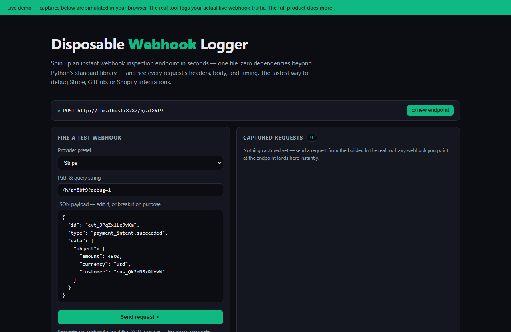

# Disposable Webhook Logger — live demo

  

  <a href="https://amos-mig.github.io/disposable-webhook-logger-demo/"><strong>▶ Open the live demo</strong></a> ·
  <a href="https://amosmign.gumroad.com/l/disposable-webhook-logger"><strong>Get the full product · €29</strong></a>

## What this is

An in-browser playground that simulates the Disposable Webhook Logger: you fire preset Stripe, GitHub, Shopify, or custom webhook requests at a disposable endpoint and inspect the captured headers, pretty-printed body, query string, timing, and response in a request history. Invalid JSON is still captured and flagged like the real logger, while locked cards tease replay and signature verification from the paid kit.

**Try it:** Pick a provider preset, edit (or deliberately break) the JSON payload, hit Send request, then click a captured row to inspect its headers, body, and timing.

## What you get in the full product

- Instant endpoint — run the file and you're live
- Captures headers, payloads, query strings, and timing
- Request history with pretty-printed output for inspection
- Perfect for debugging Stripe, GitHub, and Shopify webhooks
- Zero dependencies beyond Python's standard library

## About

- **Storefront:** [kits.amosmignery.dev](https://kits.amosmignery.dev) — single-file products, instant download, commercial license
- **Checkout:** [Gumroad](https://amosmign.gumroad.com/l/disposable-webhook-logger) (Merchant of Record, VAT handled)
- **Full product:** [Disposable Webhook Logger](https://amosmign.gumroad.com/l/disposable-webhook-logger) · €29

## License

The demo page in this repo is MIT-licensed — reuse the technique, not the product.
The **Disposable Webhook Logger** itself is not included here and is not free software.
